# Quiz
 This Quiz project is done by using Node.js and MongoDB.  
 Download and navigate to this project, type `npm run devStart` to start the server.
 
 ## Login Page(index.html)
 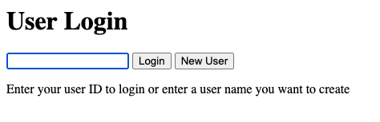
 
 When the Login button is pressed with a faulty ID.   
 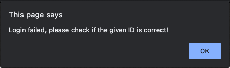
 
 When the New User button is pressed with a blank user name.   
 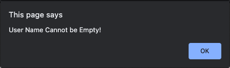
 
 New User is Created.   
 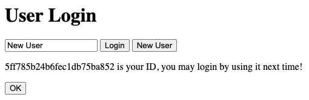
 
 After the OK button is clicked(when new user created) or Login successfully. 
 The Actions page shows up. 
 
 ## Action Page(action.html). 
 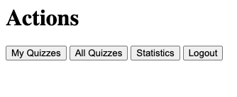
 
 ## Quiz Browser(browseQuizzes.html). 
 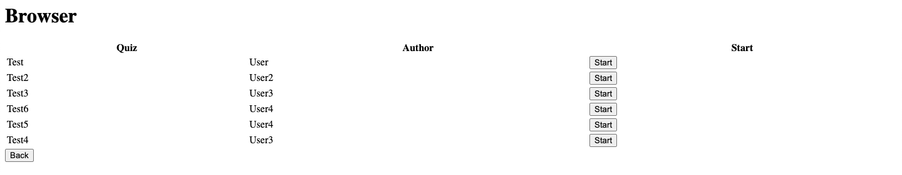
 
 When a Start button is pressed. 
 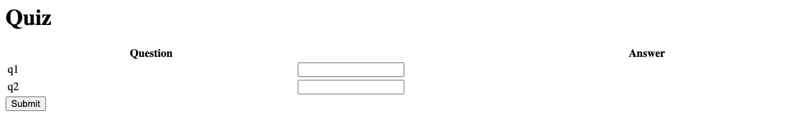
 
 After the Submit button is pressed, the score shows up.   
 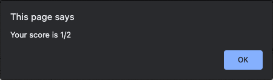
 
 Then the Back button will be available. 
 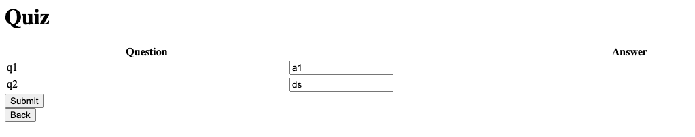
 
 ## My Quizzes(myQuiz.html). 
 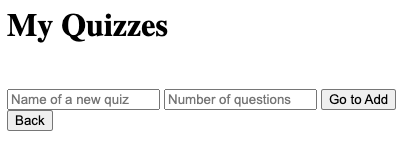
 
 When user tries to add a quiz without name.   
 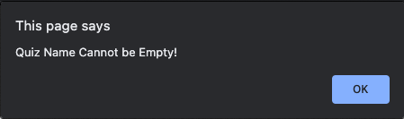
 
 When user tries to add a quiz without number of questions.   
 
 
 Example Quiz.   
 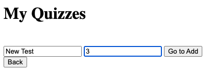
 
 When the Go to Add button is clicked  
 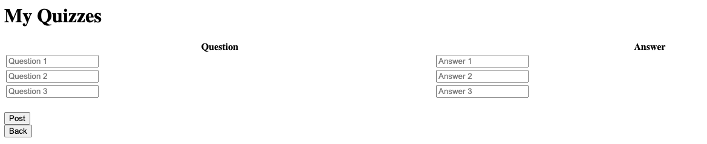
 
 When empty questions or answers were given.   
 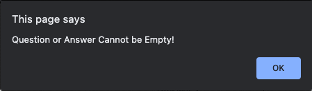
 
 Example Question Set. 
 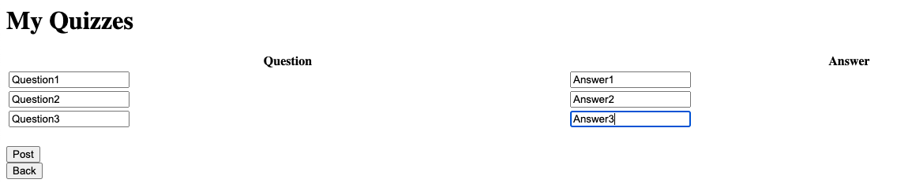
 
 After the quiz is posted. 
 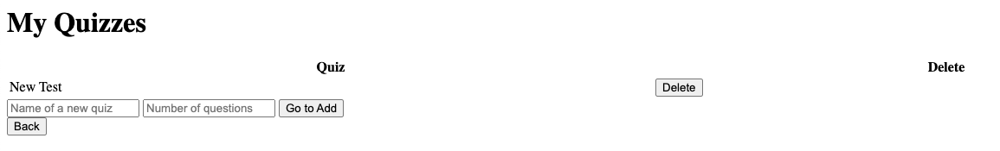
 
 Back to Quiz Browser to check. 
 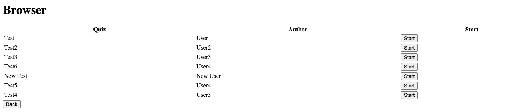
 
 ## Statistics(statistics.html)
 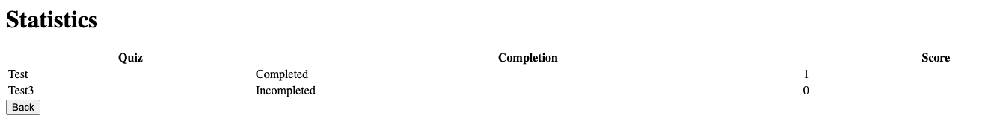

 ## Flowchart
 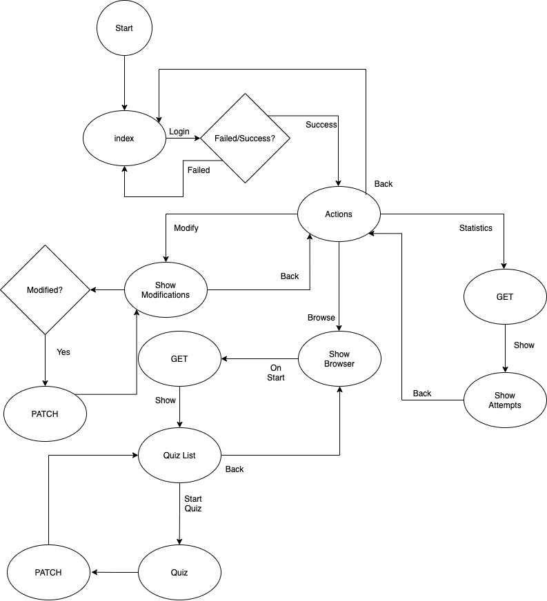
 
 ## Database Structure
 ```
 user: {
  name: String,
  accessToken: String (jwt)
 }
 
 stat: {
  userId: String,
  userName: String,
  quizId: String,
  quizName: String,
  completion: String,
  score: Number
 }
 
 quiz: {
  name: String
  questions:[{
   question: String
   answer: String
   }]
 }
 ```
 
  ## APIs
  ```
  //url_to_server is the path to server, if running locally use localhost
  //Content-Type: application/json
  
  GET http://url_to_server:3000/users 
  //Return all users
  
  GET http://url_to_server:3000/users/user_id 
  //Return a user by _id
  
  POST http://url_to_server:3000/users 
  //Create a user
  //The access token will be generated
  
  PATCH http://url_to_server:3000/users/user_id 
  //Update a user by _id
  
  DELETE http://url_to_server:3000/users/user_id 
  //Delete a user by _id
  
  GET http://url_to_server:3000/quizzes 
  //Return all quizzes
  
  GET http://url_to_server:3000/quizzes//myQuizzes
  Authorization: Bearer TOKEN
  //Return all quizzes under a user
  
  POST http://url_to_server:3000/quizzes
  Authorization: Bearer TOKEN
  //Create a quiz
  
  PATCH http://url_to_server:3000/quizzes/quiz_id
  Authorization: Bearer TOKEN
  //Update a quiz
  
  DELETE http://url_to_server:3000/quizzes/quiz_id
  Authorization: Bearer TOKEN
  //Delete a quiz
  
  GET http://url_to_server:3000/stats
  //Return all attempts
  
  GET http://url_to_server:3000/stats/myStats
  Authorization: Bearer TOKEN
  //Return all attempts under a user
  
  POST http://url_to_server:3000/stats
  Authorization: Bearer TOKEN
  //Create an attempt
  ```
 
